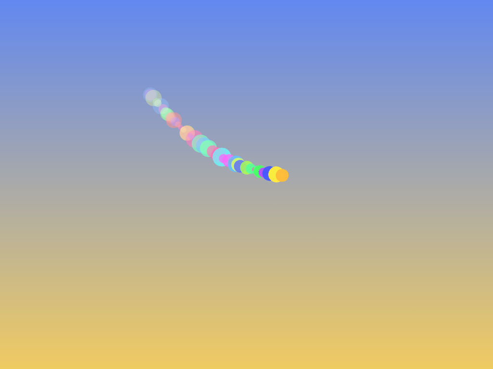
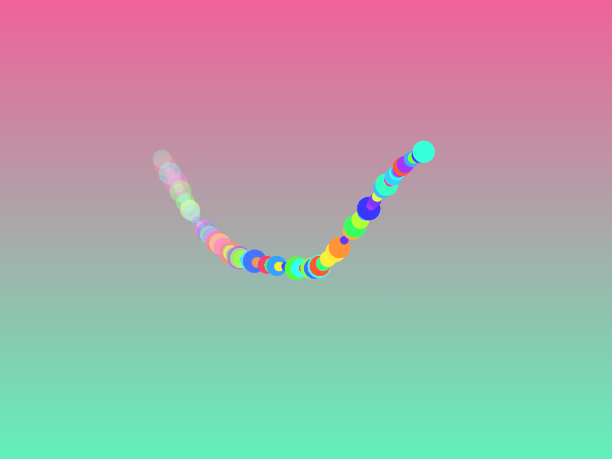

import P5Sketch from '../../../components/P5Sketch.astro';
import { Aside } from '@astrojs/starlight/components';

## Propósito

Aprender sobre estructuras de datos como formas de organizar y almacenar datos en una computadora para que puedan ser utilizados de manera eficiente. En esta unidad analizarás cómo se implementa una lista enlazada y luego abordarás una nueva estructura de datos para usarla en el marco de una aplicación creativa interactiva.

## Actividades

### Actividad 01

#### Visualizando listas enlazadas con openFrameworks

En esta actividad vamos a analizar juntos una aplicación creativa interactiva que utiliza una lista enlazada para solucionar 
un reto creativo.

El código de nuestro caso de estudio es este:

`ofApp.cpp`:

``` cpp
#include "ofApp.h"

//--------------------------------------------------------------
void ofApp::setup() {
    backgroundHue = 0;

    // Inicializa la serpiente con varios nodos en el centro
    for (int i = 0; i < 20; i++) {
        snake.emplace_back(ofGetWidth() / 2, ofGetHeight() / 2);
    }
}

//--------------------------------------------------------------
void ofApp::update() {

    glm::vec2 target = glm::vec2(ofGetMouseX(), ofGetMouseY());
    float interpolationFactor = 0.2;  // controla la velocidad de movimiento (0-1)

    for (auto& pos : snake) {
        pos = glm::mix(glm::vec3(pos, 0.0f), glm::vec3(target, 0.0f), 0.2); // Se mueve gradualmente
        target = pos;  // Cada nodo sigue al anterior
    }

    backgroundHue = fmod(backgroundHue + 0.1, 255);
}

//--------------------------------------------------------------
void ofApp::draw() {
    // Fondo dinámico con gradiente
    ofColor color1 = ofColor::fromHsb(backgroundHue, 150, 240);
    ofColor color2 = ofColor::fromHsb(fmod(backgroundHue + 128, 255), 150, 240);
    ofBackgroundGradient(color1, color2, OF_GRADIENT_LINEAR);

    
    // curva suave conectando los nodos
    if (snake.size() > 1) {
        ofMesh mesh;
        mesh.setMode(OF_PRIMITIVE_LINE_STRIP);
        int index = 0;
        for (const auto& pos : snake) {
            float hue = ofMap(index++, 0, snake.size() - 1, 0, 255);
            mesh.addColor(ofColor::fromHsb(hue, 200, 255));
            mesh.addVertex(glm::vec3(pos, 0.0f));
        }
        ofSetLineWidth(2);
        mesh.draw();
    }
    
    // Círculos con tamaño y color variable   
    int index = 0;
    ofNoFill();
    ofSetLineWidth(2);
    for (const auto& pos : snake) {
        float hue = ofMap(index, 0, snake.size() - 1, 0, 255);
        ofSetColor(ofColor::fromHsb(hue, 220, 255));
        float radius = ofMap(index++, 0, snake.size() - 1, 20, 5);
        ofDrawCircle(pos.x, pos.y, radius);
    }
       
}

//--------------------------------------------------------------
void ofApp::keyPressed(int key) {
    if (key == 'c') {
        snake.clear();
    }
    else if (key == 'a') {
        snake.emplace_back(ofRandomWidth(), ofRandomHeight());
	}
	else if (key == 'r') {
        if (!snake.empty()) {
            snake.pop_back();
        }
		
	}
	else if (key == 's') {
		ofSaveFrame();
	}
}
```

`ofApp.h`:

``` cpp
#pragma once

#include "ofMain.h"
#include <list>

class ofApp : public ofBaseApp {
public:
    std::list<glm::vec2> snake;
    float backgroundHue;

    void setup();
    void update();
    void draw();
    void keyPressed(int key);
};
```


### Actividad 02

#### Implementación de la lista enlazada

En la actividad anterior te mostré cómo se utiliza una lista enlazada, vamos a analizar 
juntos cómo se podría implementar.

`ofApp.h`:

``` cpp	
#pragma once
#include "ofMain.h"

class Node {
public:
    glm::vec2 position;
    Node* next;

    Node(glm::vec2 pos) : position(pos), next(nullptr) {}
};

class LinkedList {
public:
    Node* head;
    Node* tail;
    int size;

    LinkedList() : head(nullptr), tail(nullptr), size(0) {}

    ~LinkedList() {
        clear();
    }

    void push_back(glm::vec2 pos) {
        Node* newNode = new Node(pos);
        if (head == nullptr) {
            head = tail = newNode;
        }
        else {
            tail->next = newNode;
            tail = newNode;
        }
        size++;
    }

    void pop_back() {
        if (head == nullptr) return;

        if (head == tail) { // Si solo hay un elemento
            delete head;
            head = tail = nullptr;
        }
        else {
            Node* temp = head;
            while (temp->next != tail) {
                temp = temp->next;
            }
            delete tail;
            tail = temp;
            tail->next = nullptr;
        }
        size--;
    }

    void clear() {
        Node* current = head;
        while (current != nullptr) {
            Node* nextNode = current->next;
            delete current;
            current = nextNode;
        }
        head = tail = nullptr;
        size = 0;
    }
};


class ofApp : public ofBaseApp {
public:
    LinkedList snake;
    float backgroundHue;

    void setup();
    void update();
    void draw();
    void keyPressed(int key);
};

```

`ofApp.cpp`:

``` cpp
#include "ofApp.h"

//--------------------------------------------------------------
void ofApp::setup() {
    backgroundHue = 0;

    // Inicializa la serpiente con varios nodos en el centro
    for (int i = 0; i < 20; i++) {
        snake.push_back(glm::vec2(ofGetWidth() / 2, ofGetHeight() / 2));
    }
}

//--------------------------------------------------------------
void ofApp::update() {
    if (snake.head == nullptr) return;

    glm::vec2 target = glm::vec2(ofGetMouseX(), ofGetMouseY());
    float interpolationFactor = 0.2;

    Node* current = snake.head;
    while (current != nullptr) {
        // glm::mix(x, y, a)
        // mix performs a linear interpolation x and y using a to weight between them.
    // The value is computed as x * (1 - a) + y * a.
        current->position = glm::mix(glm::vec3(current->position, 0.0f), glm::vec3(target, 0.0f), interpolationFactor);
        target = current->position;
        current = current->next;
    }

    backgroundHue = fmod(backgroundHue + 0.1, 255);
}

//--------------------------------------------------------------
void ofApp::draw() {
    ofColor color1 = ofColor::fromHsb(backgroundHue, 150, 240);
    ofColor color2 = ofColor::fromHsb(fmod(backgroundHue + 128, 255), 150, 240);
    ofBackgroundGradient(color1, color2, OF_GRADIENT_LINEAR);

    if (snake.head == nullptr) return;

    ofMesh mesh;
    mesh.setMode(OF_PRIMITIVE_LINE_STRIP);
    Node* current = snake.head;
    int index = 0;

    while (current) {
        float hue = ofMap(index++, 0, snake.size - 1, 0, 255);
        mesh.addColor(ofColor::fromHsb(hue, 200, 255));
        mesh.addVertex(glm::vec3(current->position, 0.0f));
        current = current->next;
    }

    ofSetLineWidth(2);
    mesh.draw();

    // Círculos con tamaño y color variable
    current = snake.head;
    index = 0;
    ofNoFill();
    ofSetLineWidth(2);

    while (current) {
        float hue = ofMap(index, 0, snake.size - 1, 0, 255);
        ofSetColor(ofColor::fromHsb(hue, 220, 255));
        float radius = ofMap(index++, 0, snake.size - 1, 20, 5);
        ofDrawCircle(current->position.x, current->position.y, radius);
        current = current->next;
    }
}

//--------------------------------------------------------------
void ofApp::keyPressed(int key) {
    if (key == 'c') {
        snake.clear();
    }
    else if (key == 'a') {
        snake.push_back(glm::vec2(ofRandomWidth(), ofRandomHeight()));
    }
    else if (key == 'r') {
        snake.pop_back();
    }
    else if (key == 's') {
        ofSaveFrame();
    }
}
```

Para entender mejor el código anterior te voy a proponer que veas 
un par de simulaciones.

Para esta parte:

``` cpp
Node* current = snake.head;
while (current != nullptr) {
    current->position = glm::mix(glm::vec3(current->position, 0.0f), glm::vec3(target, 0.0f), interpolationFactor);
    target = current->position;
    current = current->next;
}
```

<P5Sketch 
  sketchUrl="/computacionales-2026-20/sketches/interpolation.js" 
  containerId="interpolation"
  styleClass="p5-container-interpolation"
/>

Y para entender mejor el manejo del color: 

<P5Sketch 
  sketchUrl="/computacionales-2026-20/sketches/colorWheel.js" 
  containerId="colorWheel"
  styleClass="p5-container-colorWheel"
/>

### Actividad 03

En esta actividad te toca a ti analizar una estructura de datos 
e implementarla.

Implementarás una cola (FIFO - First In, First Out) para crear un 
efecto de pintura dinámica en la pantalla. Cada vez que el usuario 
mueve el mouse, se agregará un trazo en la pantalla, pero los trazos 
más antiguos en la cola tendrán menos opacidad.

Te preguntarás ¿Cómo funciona una FIFO? Puedes pensar en una fila para 
comprar el almuerzo en la cafetería. La primera persona en llegar 
es la primera en ser atendida. De manera similar, en una cola FIFO, 
los elementos se procesan en el orden en que fueron añadidos. Los 
primeros en ingresar son los primeros en salir, son los más antiguos.

Tu tarea es implementar la estructura de datos BrushQueue y completar el 
código de ofApp.cpp donde faltan fragmentos clave. ¿Cómo? Lo primero 
es que analices de nuevo cómo implementamos la lista enlazada y luego 
transfieras ese conocimiento a la implementación de la cola FIFO. No olvides 
que el primer dato en entrar es el primero en salir (FIFO).

**REQUISITOS**

1. Implementar una cola (BrushQueue) desde cero sin usar std::queue ni std::list. La idea 
es que implementes desde cero la estructura de datos.

2. Cada nodo de la cola debe almacenar:

    - La posición (x, y) del trazo.
    - El radio del trazo.
    - El color del trazo.
    - La opacidad del trazo.

3. Funciones obligatorias en BrushQueue:

    - enqueue(x, y, radius, color, opacity): agregar un nuevo trazo.
    - dequeue(): eliminar el trazo más antiguo cuando se alcance el tamaño máximo.
    - clear(): eliminar todos los trazos.
    - isEmpty(): indicar si la cola está vacía.

4. Comportamiento del programa:

    - Cuando el usuario mueve el mouse, se debe agregar un nuevo trazo con un color aleatorio.
    - Cuando el usuario presiona 'c', se deben borrar todos los trazos de la pantalla.
    - Cuando el usuario presiona 'a', se debe alternar entre una cola de tamaño 50 y 100.

5. Debes gestionar correctamente la memoria para evitar fugas.

**Código base (con fragmentos faltantes)**:

ofApp.h:

``` cpp
#pragma once
#include "ofMain.h"

// Nodo de la cola
struct Node {
    float x, y;
    float radius;
    ofColor color;
    float opacity;
    Node* next;

    Node(float _x, float _y, float _radius, ofColor _color, float _opacity)
        : x(_x), y(_y), radius(_radius), color(_color), opacity(_opacity), next(nullptr) {
    }
};

// Implementación manual de una cola (FIFO)
class BrushQueue {
public:
    Node* front;
    Node* rear;
    int size;
    int maxSize;

    BrushQueue(int _maxSize);
    ~BrushQueue();
    
    void enqueue(float x, float y, float radius, ofColor color, float opacity);
    void dequeue();
    void clear();
    bool isEmpty();
};


// Constructor
BrushQueue::BrushQueue(int _maxSize) : front(nullptr), rear(nullptr), size(0), maxSize(_maxSize) {}

// Destructor
BrushQueue::~BrushQueue() {
    clear();
}

// Implementa aquí `enqueue()`
void BrushQueue::enqueue(float x, float y, float radius, ofColor color, float opacity) {
    // TODO: crear un nuevo nodo y agregarlo al final de la cola.
    // Si la cola supera `maxSize`, eliminar el nodo más antiguo con `dequeue()`.
}

// Implementa aquí `dequeue()`
void BrushQueue::dequeue() {
    // TODO: eliminar el nodo más antiguo si la cola no está vacía.
}

// Implementa aquí `clear()`
void BrushQueue::clear() {
    // TODO: eliminar todos los nodos de la cola.
}

// Implementa aquí `isEmpty()`
bool BrushQueue::isEmpty() {
    // TODO: retornar si la cola está vacía.
}


class ofApp : public ofBaseApp {
public:
    BrushQueue strokes; // Cola de trazos
    float backgroundHue = 0;

    ofApp() : strokes(50) {} // Tamaño máximo de la cola

    void setup();
    void update();
    void draw();
    void keyPressed(int key);
};

```

ofApp.cpp:

``` cpp	
#include "ofApp.h"

//--------------------------------------------------------------
void ofApp::setup() {
    ofBackground(0);
}

//--------------------------------------------------------------
void ofApp::update() {
    backgroundHue += 0.2;
    if (backgroundHue > 255) backgroundHue = 0;

    // TODO: agregar un nuevo trazo si el mouse está presionado.
    // Usa strokes.enqueue(x, y, radius, color, opacity);
}

//--------------------------------------------------------------
void ofApp::draw() {
    // Fondo con gradiente dinámico
    ofColor color1, color2;
    color1.setHsb(backgroundHue, 150, 240);
    color2.setHsb(fmod(backgroundHue + 128, 255), 150, 240);
    ofBackgroundGradient(color1, color2, OF_GRADIENT_LINEAR);

    // TODO: dibujar los trazos almacenados en la cola.
    // Recorre los nodos desde strokes.front hasta nullptr y usa ofDrawCircle().
}

//--------------------------------------------------------------
void ofApp::keyPressed(int key) {
    if (key == 'c') {
        // TODO: limpiar la cola de trazos.
    }
    if (key == 'a') {
        // TODO: alternar entre 50 y 100 trazos.
    }
    else if (key == 's') {
        // TODO: guardar el frame actual.
    }
}

```

**Resultado esperado**:

maxSize = 50



maxSize = 100



En este video puedes ver cómo debería funcionar la aplicación:

[Video de demostración](https://youtu.be/VRDRZTKPTx8)

### Actividad 04

En esta actividad vamos a realizar la evaluación de la unidad.
