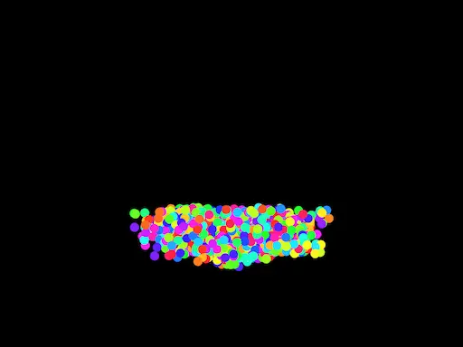
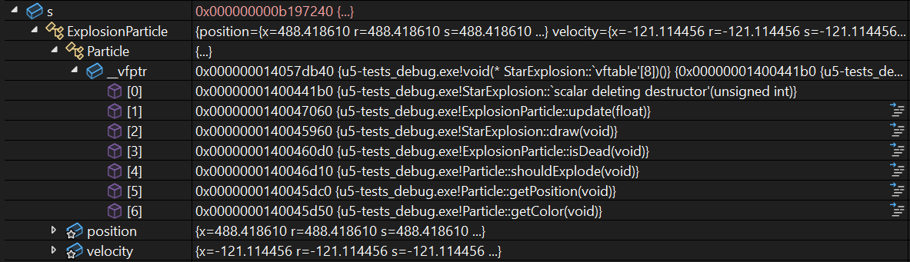

## Propósito

En esta unidad vas a profundizar en los principios fundamentales de la Programación 
Orientada a Objetos (OOP) usando C++. No solo usarás la herencia, el polimorfismo 
y el encapsulamiento: también observarás cómo funcionan por dentro, “bajo el capó”. 
Usaremos un caso de estudio de fuegos artificiales construido con openFrameworks 
para analizar, con el depurador, cómo se organizan los objetos en memoria, cómo se 
implementa la tabla de funciones virtuales (_vtable_) y cómo se despacha dinámicamente 
el polimorfismo en tiempo de ejecución.

## Actividades

En estas actividades trabajaremos juntos en clase. Yo te propondré preguntas, experimentos 
y modificaciones; tú formularás hipótesis, ejecutarás el código, observarás lo 
que ocurre y explicarás tus conclusiones. Las respuestas, capturas, dibujos y 
pruebas las construiremos y revisaremos durante la clase; puedes usar tu bitácora 
personal para registrar tus observaciones y conclusiones.

### Actividad 01

#### Diagnóstico: recordando la OOP desde C#

En esta primera actividad vamos a recuperar lo que ya sabes de la Programación Orientada a Objetos. No es una prueba: es un punto de partida que nos permitirá reconocer qué conceptos manejas bien y cuáles debemos explorar con más cuidado.

**Parte 1: recordemos los conceptos en C#**

En tus cursos anteriores has trabajado principalmente con C#. Basándote en esa experiencia, responde con tus propias palabras:

1. ¿Qué es el encapsulamiento para ti? Describe una situación en la que te haya sido útil o en la que hayas visto su importancia.
2. ¿Qué es la herencia? ¿Por qué un programador decidiría usarla? Da un ejemplo sencillo.
3. ¿Qué es el polimorfismo? Describe con tus palabras qué significa que un código sea “polimórfico”.

**Parte 2: analicemos código en C#**

```csharp
using System;
using System.Collections.Generic;

public abstract class Figura
{
    public string Nombre{get; protected set;}

    public Figura(string nombre)
    {
        this.Nombre = nombre;
    }

    public abstract void Dibujar();
}

public class Circulo : Figura
{
    public double Radio { get; private set; }

    public Circulo(double radio) : base("Círculo")
    {
        this.Radio = radio;
    }

    public override void Dibujar()
    {
        Console.WriteLine($"Dibujando un {Nombre} de radio {Radio}.");
    }
}

public class Rectangulo : Figura
{
    public double Base { get; private set; }
    public double Altura { get; private set; }

    public Rectangulo(double b, double h) : base("Rectángulo")
    {
        this.Base = b;
        this.Altura = h;
    }

    public override void Dibujar()
    {
        Console.WriteLine($"Dibujando un {Nombre} de {Base}x{Altura}.");
    }
}

public class Programa
{
    public static void Main()
    {
        List<Figura> misFiguras = new List<Figura>();

        misFiguras.Add(new Circulo(5.0));
        misFiguras.Add(new Rectangulo(4.0, 6.0));
        misFiguras.Add(new Circulo(10.0));

        foreach (Figura fig in misFiguras)
        {
            fig.Dibujar();
        }
    }
}
```

Ahora responde estas preguntas sobre el código:

**Encapsulamiento:**

- Señala una línea que sea un ejemplo claro de encapsulamiento y explica por qué lo es.
- ¿Por qué crees que el campo `nombre` es `private`, pero la propiedad `Nombre` es `public`? ¿Qué problema se evita con esto?

**Herencia:**

- ¿Cómo se evidencia la herencia en la clase `Circulo`?
- Además de `Radio`, ¿qué otros datos almacena en su interior un objeto de tipo `Circulo` gracias a la herencia?

**Polimorfismo:**

- Observa el bucle `foreach`. La variable `fig` es de tipo `Figura`, pero a veces contiene un `Circulo` y otras un `Rectangulo`. Cuando se llama a `fig.Dibujar()`, el programa ejecuta la versión correcta. ¿Cómo crees que funciona esto “por debajo”?

**Parte 3: formulemos hipótesis sobre la implementación**

Imagina que eres un diseñador de lenguajes de programación y tienes que decidir cómo }
implementar estos conceptos. No hay respuestas incorrectas en esta parte; lo importante es 
que expliques tus ideas. Dibuja si te ayuda.

1. **Memoria y herencia:** cuando creas un objeto `Rectangulo`, este tiene `Base`, `Altura` y también `Nombre`. ¿Cómo imaginas que se organizan esos tres datos en la memoria del computador para formar un solo objeto?
2. **El mecanismo del polimorfismo:** pensemos de nuevo en la llamada `fig.Dibujar()`. El compilador solo sabe que `fig` es una `Figura`. ¿Cómo decide el programa, mientras se está ejecutando, si debe llamar al `Dibujar` del `Circulo` o al del `Rectangulo`?
3. **La barrera del encapsulamiento:** ¿Cómo crees que el compilador logra que no puedas acceder a un miembro `private` desde fuera de la clase? ¿Es algo que se revisa cuando escribes el código o una protección que existe mientras el programa se ejecuta? ¿Por qué piensas eso?

**Parte 4: reflexión y preparación**

Para cerrar el diagnóstico, comparte conmigo en clase los conceptos en los que te sientes más seguro y las preguntas que todavía tienes. También revisaremos tus hipótesis para usarlas como punto de comparación en las actividades siguientes.

### Actividad 02

#### Caso de estudio: fuegos artificiales con openFrameworks

Ahora te mostraré una aplicación que usa los conceptos que estudiaremos en esta unidad. Vamos a crear un proyecto en openFrameworks, ejecutar la aplicación y analizarla juntos sin usar IA generativa durante este primer acercamiento.

Crea el proyecto en clase y agrega el siguiente código.

`ofApp.h`:

```cpp
#pragma once
#include "ofMain.h"
#include <vector>

// -------------------------------------------------
// Clase base abstracta: Particle
// -------------------------------------------------
class Particle {
public:
    virtual ~Particle() {}
    virtual void update(float dt) = 0;
    virtual void draw() = 0;
    virtual bool isDead() const = 0;
    virtual bool shouldExplode() const { return false; }
    virtual glm::vec2 getPosition() const { return glm::vec2(0, 0); }
    virtual ofColor getColor() const { return ofColor(255); }
};

// -------------------------------------------------
// RisingParticle: Partícula que nace en la parte inferior y sube
// -------------------------------------------------
class RisingParticle : public Particle {
protected:
    glm::vec2 position;
    glm::vec2 velocity;
    ofColor color;
    float lifetime;
    float age;
    bool exploded;
public:
    RisingParticle(const glm::vec2& pos, const glm::vec2& vel,
                   const ofColor& col, float life)
        : position(pos), velocity(vel), color(col),
          lifetime(life), age(0), exploded(false) {}

    void update(float dt) override {
        position += velocity * dt;
        age += dt;
        velocity.y += 9.8f * dt * 8;
        float explosionThreshold = ofGetHeight() * 0.15f + ofRandom(-30, 30);
        if (position.y <= explosionThreshold || age >= lifetime) {
            exploded = true;
        }
    }

    void draw() override {
        ofSetColor(color);
        ofDrawCircle(position, 10);
    }

    bool isDead() const override { return exploded; }
    bool shouldExplode() const override { return exploded; }
    glm::vec2 getPosition() const override { return position; }
    ofColor getColor() const override { return color; }
};

// -------------------------------------------------
// Clase base para explosiones: ExplosionParticle
// -------------------------------------------------
class ExplosionParticle : public Particle {
protected:
    glm::vec2 position;
    glm::vec2 velocity;
    ofColor color;
    float age;
    float lifetime;
    float size;
public:
    ExplosionParticle(const glm::vec2& pos, const glm::vec2& vel,
                      const ofColor& col, float life, float sz)
        : position(pos), velocity(vel), color(col),
          age(0), lifetime(life), size(sz) {}

    void update(float dt) override {
        position += velocity * dt;
        age += dt;
        float alpha = ofMap(age, 0, lifetime, 255, 0, true);
        color.a = alpha;
    }

    bool isDead() const override { return age >= lifetime; }
};

// -------------------------------------------------
// CircularExplosion: Explosión en patrón circular
// -------------------------------------------------
class CircularExplosion : public ExplosionParticle {
public:
    CircularExplosion(const glm::vec2& pos, const ofColor& col)
        : ExplosionParticle(pos, glm::vec2(0, 0), col, 1.2f, ofRandom(16, 32)) {
        float angle = ofRandom(0, TWO_PI);
        float speed = ofRandom(80, 200);
        velocity = glm::vec2(cos(angle), sin(angle)) * speed;
    }

    void draw() override {
        ofSetColor(color);
        ofDrawCircle(position, size);
    }
};

// -------------------------------------------------
// RandomExplosion: Explosión con direcciones aleatorias
// -------------------------------------------------
class RandomExplosion : public ExplosionParticle {
public:
    RandomExplosion(const glm::vec2& pos, const ofColor& col)
        : ExplosionParticle(pos, glm::vec2(0, 0), col, 1.5f, ofRandom(16, 32)) {
        velocity = glm::vec2(ofRandom(-200, 200), ofRandom(-200, 200));
    }

    void draw() override {
        ofSetColor(color);
        ofDrawRectangle(position.x, position.y, size, size);
    }
};

// -------------------------------------------------
// StarExplosion: Explosión en forma de estrella
// -------------------------------------------------
class StarExplosion : public ExplosionParticle {
public:
    StarExplosion(const glm::vec2& pos, const ofColor& col)
        : ExplosionParticle(pos, glm::vec2(0, 0), col, 1.3f, ofRandom(20, 40)) {
        float angle = ofRandom(0, TWO_PI);
        float speed = ofRandom(90, 180);
        velocity = glm::vec2(cos(angle), sin(angle)) * speed;
    }

    void draw() override {
        ofSetColor(color);
        int rays = 5;
        float outerRadius = size;
        float innerRadius = size * 0.5f;
        ofPushMatrix();
        ofTranslate(position);
        for (int i = 0; i < rays; i++) {
            float theta = ofMap(i, 0, rays, 0, TWO_PI);
            float xOuter = cos(theta) * outerRadius;
            float yOuter = sin(theta) * outerRadius;
            float xInner = cos(theta + PI / rays) * innerRadius;
            float yInner = sin(theta + PI / rays) * innerRadius;
            ofDrawLine(0, 0, xOuter, yOuter);
            ofDrawLine(xOuter, yOuter, xInner, yInner);
        }
        ofPopMatrix();
    }
};

// -------------------------------------------------
// ofApp: Manejo de la escena y eventos
// -------------------------------------------------
class ofApp : public ofBaseApp {
public:
    void setup();
    void update();
    void draw();
    void mousePressed(int x, int y, int button);
    void keyPressed(int key);

    std::vector<Particle*> particles;
    ~ofApp();

private:
    void createRisingParticle();
};
```

`ofApp.cpp`:

```cpp
#include "ofApp.h"

// --------------------------------------------------------------
void ofApp::setup() {
    ofSetFrameRate(60);
    ofBackground(0);
}

// --------------------------------------------------------------
void ofApp::update() {
    float dt = ofGetLastFrameTime();

    for (int i = 0; i < particles.size(); i++) {
        particles[i]->update(dt);
    }

    for (int i = particles.size() - 1; i >= 0; i--) {
        if (particles[i]->shouldExplode()) {
            int explosionType = (int)ofRandom(3);
            int numParticles = (int)ofRandom(20, 30);
            for (int j = 0; j < numParticles; j++) {
                if (explosionType == 0) {
                    particles.push_back(new CircularExplosion(
                        particles[i]->getPosition(), particles[i]->getColor()));
                } else if (explosionType == 1) {
                    particles.push_back(new RandomExplosion(
                        particles[i]->getPosition(), particles[i]->getColor()));
                } else {
                    particles.push_back(new StarExplosion(
                        particles[i]->getPosition(), particles[i]->getColor()));
                }
            }
            delete particles[i];
            particles.erase(particles.begin() + i);
        } else if (particles[i]->isDead()) {
            delete particles[i];
            particles.erase(particles.begin() + i);
        }
    }
}

// --------------------------------------------------------------
void ofApp::draw() {
    for (int i = 0; i < particles.size(); i++) {
        particles[i]->draw();
    }
}

// --------------------------------------------------------------
void ofApp::createRisingParticle() {
    float minX = ofGetWidth() * 0.35f;
    float maxX = ofGetWidth() * 0.65f;
    float spawnX = ofRandom(minX, maxX);
    glm::vec2 pos(spawnX, ofGetHeight());
    glm::vec2 target(ofGetWidth() / 2.0f + ofRandom(-300, 300),
                     ofGetHeight() * 0.10f + ofRandom(-30, 30));
    glm::vec2 direction = glm::normalize(target - pos);
    glm::vec2 vel = direction * ofRandom(250, 350);
    ofColor col;
    col.setHsb(ofRandom(255), 220, 255);
    float lifetime = ofRandom(1.5f, 3.5f);
    particles.push_back(new RisingParticle(pos, vel, col, lifetime));
}

// --------------------------------------------------------------
void ofApp::mousePressed(int x, int y, int button) {
    createRisingParticle();
}

// --------------------------------------------------------------
void ofApp::keyPressed(int key) {
    if (key == ' ') {
        for (int i = 0; i < 1000; i++) {
            createRisingParticle();
        }
    }
    if (key == 's') {
        ofSaveScreen("screenshot_" + ofToString(ofGetFrameNum()) + ".png");
    }
}

// --------------------------------------------------------------
ofApp::~ofApp() {
    for (int i = 0; i < particles.size(); i++) {
        delete particles[i];
    }
    particles.clear();
}
```

Ejecuta la aplicación y analiza conmigo qué está haciendo el código. No quiero que memorices una explicación: quiero que relaciones lo que observas en pantalla con las clases, los atributos, los métodos y el vector de punteros.

Cuando ejecutes la aplicación deberías ver situaciones como estas:





En clase toma capturas de algunos estados de la aplicación y explícame qué evento o parte del código produce cada uno. También vamos a comparar tus observaciones con el código y a identificar qué preguntas quedan abiertas para el uso del depurador.

### Actividad 03

#### Objetos en memoria y la _vtable_

Ahora vamos a analizar juntos el caso de estudio con el depurador. La pregunta que guiará esta actividad es: ¿Cómo se ve un objeto de C++ en la memoria?

Usa el depurador para encontrar la instancia de la clase `ofApp`. Recuerda que el objeto solo estará en memoria mientras la aplicación esté corriendo.

Observa la clase `ofApp`:

```cpp
class ofApp : public ofBaseApp {
public:
    void setup();
    void update();
    void draw();
    void mousePressed(int x, int y, int button);
    void keyPressed(int key);

    std::vector<Particle*> particles;
    ~ofApp();

private:
    void createRisingParticle();
};
```

Antes de ejecutar el experimento, dime qué esperas ver en memoria. Después ejecuta el código, abre el depurador y captura el objeto `ofApp`. ¿Qué puedes observar? ¿Qué información te proporciona el depurador? ¿Qué puedes concluir?

Ahora usa de nuevo el depurador para capturar un objeto de tipo `CircularExplosion`. Puede que necesites hacer modificaciones mínimas en el código para capturarlo con mayor facilidad. Abre las ventanas **Auto** o **Locals** y **Memory 1**. Trata de encontrar en memoria todas las partes que componen el objeto `CircularExplosion`. Ten a mano la jerarquía completa de clases para identificar cada parte. ¿Qué puedes observar? ¿Qué puedes concluir?

**Concepto de los métodos virtuales:** observa de nuevo en memoria un objeto de tipo `CircularExplosion`. El primer campo en memoria del objeto es un `ExplosionParticle`. Abre `ExplosionParticle` y observa que el primer campo es un `Particle`. Abre `Particle` y observa que el primer campo es `_vtable`. Ese es un puntero a la tabla de funciones virtuales.

Captura la `_vtable` de un objeto `CircularExplosion` y muéstramela en clase. Observa detenidamente la tabla de funciones: ¿Qué puedes ver?

Este es un ejemplo de cómo se puede ver la tabla de funciones:


Ahora captura la `_vtable` de un objeto `StarExplosion` y muéstramela en clase.

Este es un ejemplo de cómo se puede ver la tabla de funciones:



Observa ambas tablas y compáralas. ¿Qué puedes ver? ¿Qué relación existe entre la tabla de funciones y los métodos virtuales? ¿Para qué crees que puede servir una tabla de funciones virtuales? Para responder, piensa en el polimorfismo con interfaces y clases abstractas que viste en C#:

```csharp
using System;

interface IAnimal
{
    void HacerSonido();
}

class Perro : IAnimal
{
    public void HacerSonido()
    {
        Console.WriteLine("El perro ladra: ¡Guau, guau!");
    }
}

class Gato : IAnimal
{
    public void HacerSonido()
    {
        Console.WriteLine("El gato maúlla: ¡Miau, miau!");
    }
}

class Program
{
    static void Main()
    {
        IAnimal[] animales = new IAnimal[]
        {
            new Perro(),
            new Gato()
        };

        foreach (IAnimal animal in animales)
        {
            animal.HacerSonido();
        }
    }
}
```

Nota que `HacerSonido` se llama una vez para el perro y otra para el gato. ¿Cómo sabe la función sobre cuál objeto debe actuar? Vamos a contrastar tus hipótesis con lo que observemos en el depurador.

### Actividad 04

#### Encapsulamiento

Vamos a estudiar el encapsulamiento mediante los modificadores de acceso. Crea en clase un proyecto de consola de C++ en Visual Studio y experimenta con el siguiente código:

```cpp
class AccessControl {
private:
    int privateVar;

protected:
    int protectedVar;

public:
    int publicVar;
    AccessControl() : privateVar(1), protectedVar(2), publicVar(3) {}
};

int main() {
    AccessControl ac;
    ac.publicVar = 10;       // Válido
    // ac.protectedVar = 20; // Error de compilación
    // ac.privateVar = 30;   // Error de compilación
    return 0;
}
```

Ejecuta este código. Luego descomenta las líneas comentadas y vuelve a compilar. ¿Qué sucede? ¿Por qué? ¿Qué puedes concluir?

Ahora observa algo importante: el encapsulamiento se verifica en tiempo de compilación. Analiza el siguiente programa:

```cpp
#include <iostream>

class MyClass {
private:
    int secret1;
    float secret2;
    char secret3;

public:
    MyClass(int s1, float s2, char s3) : secret1(s1), secret2(s2), secret3(s3) {}

    void printMembers() const {
        std::cout << "secret1: " << secret1 << "\n";
        std::cout << "secret2: " << secret2 << "\n";
        std::cout << "secret3: " << secret3 << "\n";
    }
};

int main() {
    MyClass obj(42, 3.14f, 'A');
    // Esta línea causará un error de compilación:
    std::cout << obj.secret1 << std::endl;

    obj.printMembers();
    return 0;
}
```

Compila el programa y dime qué pasa. Luego prueba este segundo programa:

```cpp
#include <iostream>

class MyClass {
private:
    int secret1;
    float secret2;
    char secret3;

public:
    MyClass(int s1, float s2, char s3) : secret1(s1), secret2(s2), secret3(s3) {}

    void printMembers() const {
        std::cout << "secret1: " << secret1 << "\n";
        std::cout << "secret2: " << secret2 << "\n";
        std::cout << "secret3: " << secret3 << "\n";
    }
};

int main() {
    MyClass obj(42, 3.14f, 'A');

    // Usando reinterpret_cast para violar el encapsulamiento
    int* ptrInt = reinterpret_cast<int*>(&obj);
    float* ptrFloat = reinterpret_cast<float*>(ptrInt + 1);
    char* ptrChar = reinterpret_cast<char*>(ptrFloat + 1);

    std::cout << "Accediendo directamente a los miembros privados:\n";
    std::cout << "secret1: " << *ptrInt << "\n";
    std::cout << "secret2: " << *ptrFloat << "\n";
    std::cout << "secret3: " << *ptrChar << "\n";

    return 0;
}
```

Compila y ejecuta. ¿Qué puedes concluir? Finalmente, explícame con tus propias palabras qué es el encapsulamiento, por qué es importante y si constituye una protección de tiempo de compilación, de tiempo de ejecución o de ambos tipos.

### Actividad 05

#### Herencia y polimorfismo

Ahora vamos a conectar la herencia con el polimorfismo. Vuelve al caso de estudio y observa la clase `CircularExplosion`: esta clase hereda de `ExplosionParticle`, que a su vez hereda de `Particle`.

Captura con el depurador la memoria que ocupa un objeto `CircularExplosion` y compara la jerarquía de clases con los campos en memoria. ¿Qué puedes observar? ¿Cómo se implementa la herencia en C++?

C++ permite algo que C# no permite de la misma manera: **herencia múltiple**. Diseña en clase un experimento en un proyecto de consola que te permita observar en el depurador cómo se organiza en memoria un objeto cuya clase tiene herencia múltiple. Muéstrame el resultado y explica qué observas.

Ahora conecta este análisis con el polimorfismo. Observa en `ofApp.cpp` el método `update()`:

```cpp
// Actualiza todas las partículas
for (int i = 0; i < particles.size(); i++) {
    particles[i]->update(dt);
}
```

El método `update` de la clase `Particle` es virtual. Usa el depurador para analizar cómo se comporta en tiempo de ejecución cuando `particles` contiene objetos de diferentes tipos.

Observa que `update` puede comportarse de manera diferente para cada tipo de partícula. A esto le llamamos **polimorfismo en tiempo de ejecución**. Realiza en clase un dibujo que explique cómo se implementa este mecanismo usando los métodos virtuales y la `_vtable`, y luego explícamelo. ¿Qué puedes concluir? ¿Qué relación existe entre los métodos virtuales, la `_vtable` y el polimorfismo?

### Actividad 06

#### Reto integrador: extender el sistema de fuegos artificiales

Esta es la actividad individual de la unidad. La resolverás en tu propio proyecto y tomarás tus propias decisiones. Mientras trabajas, yo estaré recorriendo el salón 
para resolver las dudas de cada estudiante y acompañarte cuando encuentres una dificultad; las extensiones, pruebas y explicaciones deben ser tuyas.

En esta actividad aplicarás todo lo aprendido extendiendo el caso de estudio y demostrando tu comprensión con el depurador.

**Fase 1 — aplicación funcional**

1. Agrega **dos nuevos tipos de `Particle`** distintos a `RisingParticle`. Puedes inspirarte en los tipos de explosión existentes o crear algo completamente diferente.
2. Implementa **un nuevo modo de explosión** adicional a los tres existentes.

Puedes usar IA generativa como apoyo para proponer código. Sin embargo, construir implica responsabilidad: haber generado el código no es suficiente; debes revisarlo, 
comprenderlo, editarlo y probarlo.

**Fase 2 — evidencias de comprensión con el depurador**

Te voy a proponer una serie de pruebas y experimentos que debes realizar con el depurador para demostrar tu comprensión de la OOP. Usa tu bitácora personal 
para registrar tus observaciones y conclusiones.


**Evidencias para RAE 1 — patrones y estrategias OOP**

**Evidencia 1 — Herencia en memoria**

Demuestra con el depurador que comprendes cómo la herencia organiza los datos en memoria para uno de tus nuevos tipos de partícula. Muestra la jerarquía 
completa de objetos anidados en el objeto inspeccionado y explica qué campo pertenece a qué clase de la jerarquía.

**Evidencia 2 — La _vtable_ de tu nuevo tipo**

Demuestra con el depurador que comprendes cómo se implementa el polimorfismo a nivel de la `_vtable`. Compara la tabla de funciones de tu nuevo tipo 
con la de otro tipo existente, por ejemplo `CircularExplosion`. Explica qué entradas son iguales, cuáles son diferentes y por qué.

**Evidencia 3 — Polimorfismo en tiempo de ejecución**

Demuestra que el polimorfismo en tiempo de ejecución funciona para tu nuevo tipo: el despacho dinámico ejecuta **tu** versión del método 
virtual cuando corresponde. Muestra que el programa tomó el camino correcto y no el de otro tipo.

**Evidencia 4 — Encapsulamiento en el contexto de herencia**

Demuestra con el depurador que comprendes el encapsulamiento en el contexto de tu jerarquía de herencia. ¿Qué campos son visibles desde la subclase 
—protegidos o públicos— y cuáles no —privados—? ¿Cómo se refleja esto en la vista del depurador?

**Evidencias para RAE 2 — pruebas y depuración**

**Evidencia 5 — Ciclo de vida completo de tu partícula**

Demuestra el ciclo de vida completo de uno de tus nuevos tipos: desde su creación, cuando el objeto entra al vector, pasando por 
su estado durante `update()`, hasta su eliminación, cuando se retira del vector y se libera la memoria. Explica qué observas en cada etapa.

**Evidencia 6 — Sin fugas de memoria**

Demuestra que no hay fuga de memoria: tu partícula se elimina correctamente del vector cuando muere y la memoria se libera. Explica qué ocurre en 
el `delete` y cómo verificas que el puntero se retira del vector.

**Evidencia 7 — Prueba de condición límite**

Diseña y ejecuta un escenario de prueba deliberado para verificar una condición límite de tu implementación. Por ejemplo: 
¿Qué pasa cuando el vector de partículas se vacía completamente o cuando se crean muchas partículas al mismo tiempo? Tú decides 
qué condición quieres probar y por qué es relevante.

### Actividad 07

#### Consolidación y evaluación de la unidad

En esta actividad vamos a realizar la evaluación de la unidad.
